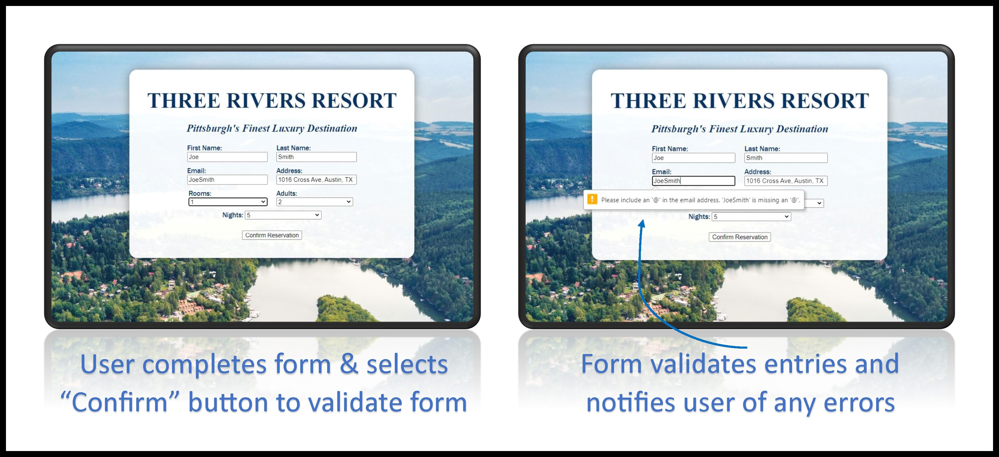

# Hotel Booking Form Website

A simple website booking form written in HTML and CSS.

The website booking form can be accessed [here](https://tkaatz.github.io/Hotel_Booking_Form_Website/).

# Screenshot

# Summary
The goal of this project is to create a simple hotel booking form to introduced HTML, CSS, and Git. It is a nice refresher on how to use HTML and CSS to create a form and validate enteries.

# Author
**Taylor Kaatz** - [Linkedin](https://www.linkedin.com/in/taylor-kaatz-9488b149/)